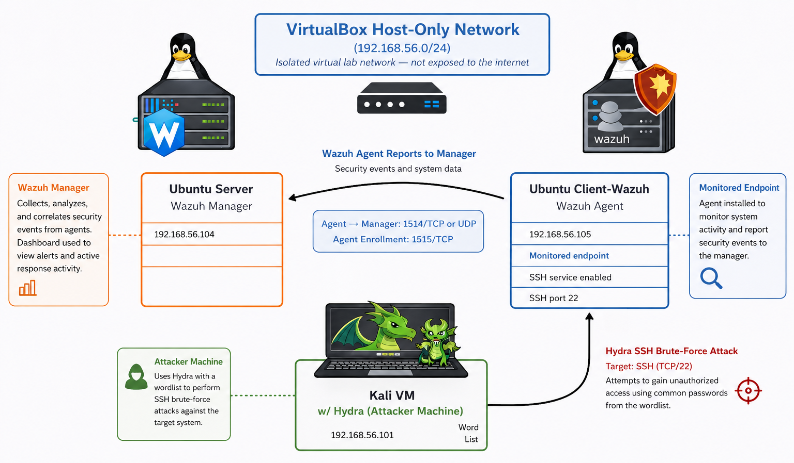
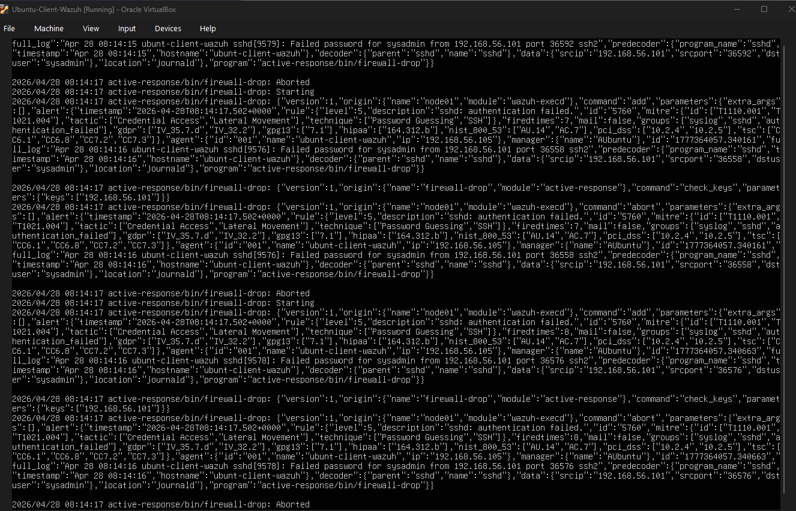
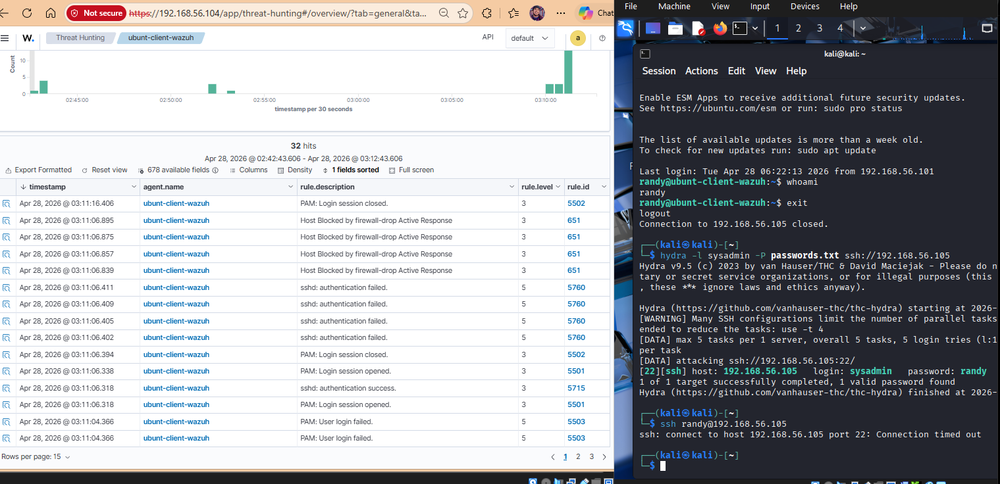
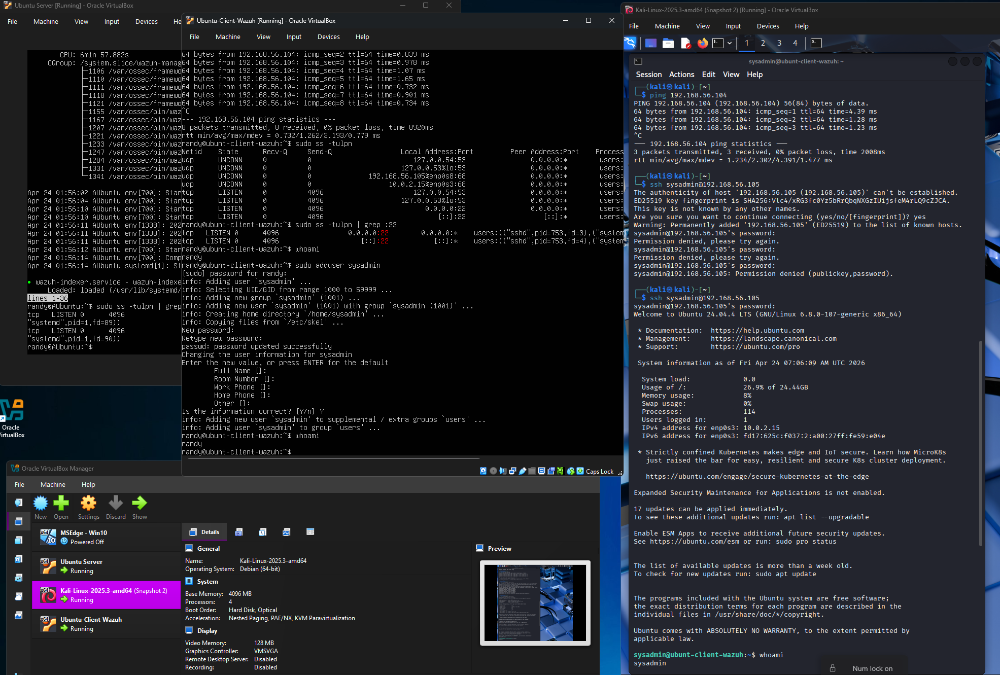

# Wazuh SSH Brute-Force Detection Lab

## Project Overview
This project demonstrates the effectiveness of Wazuh, an open-source security monitoring platform, in detecting and responding to a simulated SSH brute-force attack. The lab follows an incident response approach and highlights both detection capabilities and practical implementation challenges in a controlled environment.

## Project Relevance
Wazuh is widely used in Incident Response for log analysis, intrusion detection, and endpoint monitoring. It enables security teams to detect suspicious behavior, investigate events, and respond to threats in real time.

This project demonstrates how Wazuh can identify brute-force attacks and emphasizes the importance of proper configuration for automated response. Wazuh was selected due to its open-source accessibility and relevance to real-world security operations. This work provides hands-on experience with detection, monitoring, and response workflows commonly used in cybersecurity environments.

## Methodology

### Setup and Environment
- Kali Linux (Attacker machine)
- Ubuntu Server (Target system with SSH enabled)
- Wazuh Manager (Detection and analysis)
- Wazuh Agent (Installed on monitored endpoint)
- VirtualBox Host-Only Network (isolated lab environment)

A three-machine architecture was used. The Wazuh Manager and Agent were deployed on separate systems due to installation and operational constraints.

### Tools and Frameworks
- Wazuh (SIEM / HIDS platform)
- Hydra (brute-force attack tool)
- Linux system logs (authentication logs)

### Architecture / Workflow
1. Kali Linux initiates a brute-force attack against the Ubuntu SSH service (port 22)
2. Ubuntu logs authentication attempts in real time
3. Wazuh Agent collects logs and forwards them to the Wazuh Manager
4. Wazuh analyzes logs using built-in detection rules
5. Alerts are generated based on suspicious login patterns

### Step-by-Step Process
- Verified connectivity between attacker and target systems
- Executed Hydra brute-force attack against SSH service
- Monitored authentication logs on Ubuntu system
- Observed Wazuh alert generation in dashboard
- Identified that active response (IP blocking) did not trigger initially
- Modified configuration to enable active response
- Confirmed successful blocking of attacker IP after adjustment

## Results
- Wazuh successfully detected repeated failed SSH login attempts
- Alerts were generated identifying brute-force behavior
- Initial automated response (IP blocking) did not activate
- After configuration changes, Wazuh successfully blocked the attacking IP

These results demonstrate that Wazuh provides strong detection capabilities out-of-the-box, but response mechanisms require proper configuration.

Additional evidence of detection and response can be seen in system and Wazuh logs:

- SSH authentication failures were recorded in the Ubuntu client logs and forwarded to the Wazuh manager
- Wazuh generated alerts corresponding to failed login attempts and brute-force behavior
- Active response events (firewall-drop) were logged, indicating attempts to block the attacker IP
- After configuration adjustments, the attacker system lost connectivity to the target (connection timeout), confirming successful IP blocking

## Conclusion
This project highlights the effectiveness of Wazuh as an open-source incident response tool. It demonstrates that brute-force attacks generate clear, detectable patterns in system logs and that centralized monitoring significantly improves detection capabilities.

A key insight from this lab is the distinction between detection and response. While Wazuh detected the attack without modification, enabling automated response required additional configuration. This reinforces the importance of tuning security tools to ensure full operational effectiveness.

Future improvements could include expanding the lab to additional attack types, integrating more advanced response actions, and incorporating visualization or reporting features.

## Screenshots

### Lab Architecture and Network Setup

This diagram illustrates the three-machine lab environment, including the Wazuh Manager, Wazuh Agent (Ubuntu client), and Kali attacker machine connected through a VirtualBox host-only network.

---

### SSH Brute-Force Log Activity (Client Side)

This view shows SSH authentication failures recorded on the Ubuntu client. These logs are collected by the Wazuh agent and forwarded to the manager for analysis.

---

### Detection and Active Response (Wazuh Dashboard)

This screenshot captures the full lab in action, including the Kali attacker VM, Ubuntu client, Ubuntu server, and VirtualBox environment used to support the simulation.

The Wazuh dashboard displays detected brute-force activity, including failed login attempts and active response events. After configuration adjustments, the attacking IP is successfully blocked.

---

### Full Environment in Operation

## Author
Cybersecurity Graduate Student  
Incident Response Lab Project
